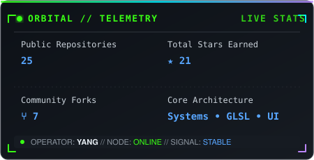
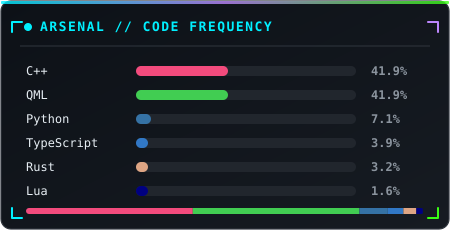

<div align="center">

<!-- Hero Banner -->


<!-- Dynamic Terminal Typing Line -->
<a href="https://github.com/conlongnhong">
  
</a>

<br>

<!-- Status Ribbons -->
<p align="center">
  
  
  
  
  
</p>

</div>

---

### 📡 `TERMINAL SYSTEM LOG`

```text
┌──[ yang@orbital-station ]──[ ~/profile ]
├── OPERATOR   : Yang (conlongnhong)
├── DESIGNATION: High school student & software tinkerer
├── PLATFORM   : Linux (Wayland // Hyprland Shell)
├── TERMINAL   : Ghostty (with live Ray-Traced Blackhole shader)
├── WORKSPACE  : Neovim • VS Code • Git
├── ARSENAL    : Rust • C++ • TypeScript • Python • Lua • GLSL
└── DIRECTIVE  : "Stay curious. Learn continuously. Turn knowledge into working systems."
```

---

### 🛸 `FEATURED EXPERIMENTS & PROJECTS`

<table>
  <tr>
    <td width="50%" valign="top">
      <h3><a href="https://github.com/conlongnhong/ghostty-blackhole">🌌 ghostty-blackhole</a></h3>
      <p>A real-time, ray-traced black hole inside Ghostty terminal that expands dynamically as the LLM context window fills up.</p>
      <p>
        
        
        
        
      </p>
    </td>
    <td width="50%" valign="top">
      <h3><a href="https://github.com/conlongnhong/caelestia-pro">🪐 caelestia-pro</a></h3>
      <p>Custom Hyprland shell suite for Ubuntu featuring animated dynamic wallpapers, Vietnamese localization, and tuned QML desktop UI.</p>
      <p>
        
        
        
        
      </p>
    </td>
  </tr>
  <tr>
    <td width="50%" valign="top">
      <h3><a href="https://github.com/conlongnhong/Antigravity-Manager">🚀 Antigravity-Manager</a></h3>
      <p>Professional account manager & switcher for Antigravity Tools with seamless 1-click account switching built on Tauri v2.</p>
      <p>
        
        
        
        
      </p>
    </td>
    <td width="50%" valign="top">
      <h3><a href="https://github.com/conlongnhong/rustzl">⚡ rustzl</a></h3>
      <p>High-performance, lightweight, asynchronous unofficial Zalo API client library built natively with Rust.</p>
      <p>
        
        
        
      </p>
    </td>
  </tr>
</table>

---

### 🛠️ `TECHNICAL ARSENAL`

<div align="center">

#### Core Programming Languages
<a href="https://skillicons.dev">
  
</a>

<br>

#### Systems, Frameworks & Graphics
<a href="https://skillicons.dev">
  
</a>

<br>

#### Environment & Workflow Tools
<a href="https://skillicons.dev">
  
</a>

</div>

---

### 📊 `TELEMETRY & ACTIVITY`

<div align="center">




<br><br>


</div>

---

### 🐍 `CONTRIBUTION MATRIX`

<div align="center">

<picture>
  <source media="(prefers-color-scheme: dark)" srcset="https://raw.githubusercontent.com/conlongnhong/conlongnhong/output/github-contribution-grid-snake-dark.svg">
  <source media="(prefers-color-scheme: light)" srcset="https://raw.githubusercontent.com/conlongnhong/conlongnhong/output/github-contribution-grid-snake.svg">
  
</picture>

</div>

---

### 🌐 `COMMUNICATION CHANNELS`

<div align="center">

<a href="https://github.com/conlongnhong">
  
</a>
&nbsp;
<a href="https://www.facebook.com/nguyen.nam.duong.63527">
  
</a>
&nbsp;
<a href="mailto:nguyennamduong7b.tv@gmail.com">
  
</a>

<br><br>

<samp>🛰️ Transmission broadcast complete // Orbital node listening...</samp>

<!-- Footer Wave -->


</div>
